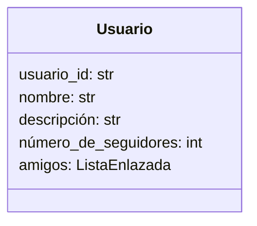
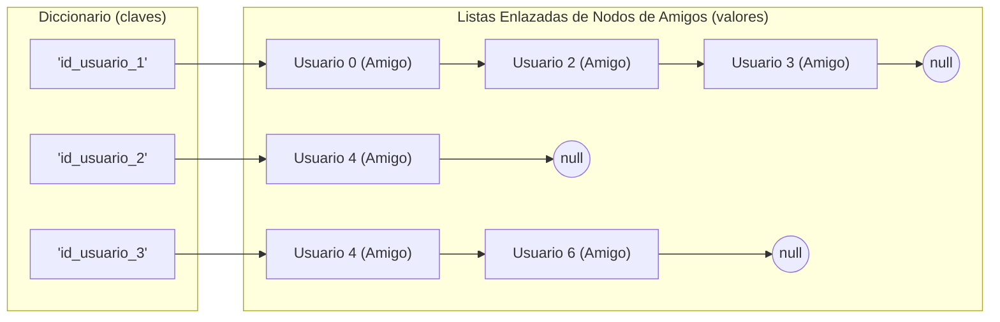
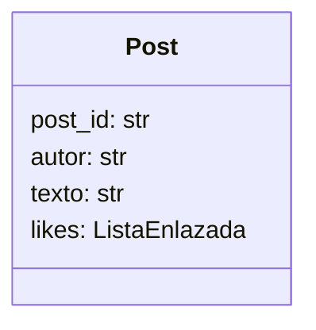
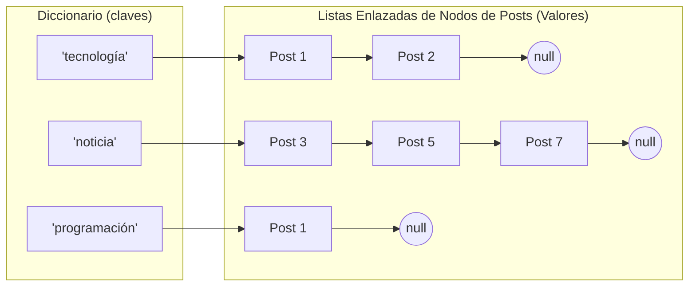
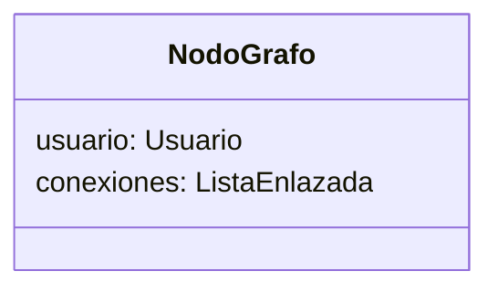
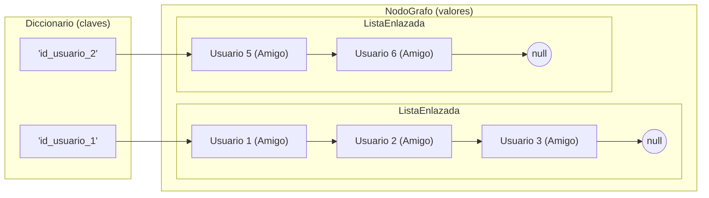

# Estructuras de Datos - Dataset de Twitter con Índice Invertido

Este proyecto implementa índices invertidos sobre memoria dinámica.

## Dataset: Twitter MBTI Personality Types

Se utiliza un dataset real extraído de Twitter que contiene:

- **Perfiles de Usuario:** Identificación única y metadatos.
- **Posts:** Contenido textual original de los tweets.
- **Seguidores:** Qué usuario sigue a qué usuario.

Debido a que el dataset carece de lo siguiente, estos datos serán generados de forma sintética:

- **Registro de Likes:** Registro de likes dados por usuarios a posts.

## Como ejecutar el proyecto

### pre-requisitos:

- Git
- Python
- [Poetry](https://python-poetry.org/docs/) (administrador de dependencias de python)

### paso a paso:

```bash
# clonar repo
git clone https://github.com/College-Homework-Repos/tarea1-estructura-de-datos-twitter-dataset.git
cd tarea1-estructura-de-datos-twitter-dataset

# instalar dependencias (para descargar el dataset)
poetry install

# ejecutar el preprocesado
# - descargar dataset, generar tablas y reducir filas.
# - preprocesar los datos
poetry run python ./preprocessing/main.py

# ejecutar el proyecto
poetry run python ./src/main.py
```

# Entrega 1

### Procesamiento de Datos

- **Reducción de filas:** Ya que el dataset cuenta con al rededor de 10.000 usuarios, los datos se han reducido a 1500 filas para probar el código `data/less_data/` y 5000 filas para la ejecución final `data/release_data/`.
- **Reducción de posts** cada usuario tiene ahora un máximo de 50 posts (en el dataset original son 200).
- **Preprocesamiento de amigos:** Se ha generado una tabla `friends.csv` a partir de la tabla `edges.csv` para facilitar la consulta de amigos de cada usuario.
- **Creación sintética de Likes:** Ya que nuestro dataset carece de información sobre los likes que ha dado cada usuario a distintos posts nosotros creamos esos datos de forma sintética y aleatoria, utilizando la información de los demás archivos CSV en `likes.csv`.

## Diagramas de las estructuras de datos creadas

### Usuarios





### Posts





# Entrega 2





# Entrega 3

placeholder

# Complejidades durante el desarrollo

placeholder
