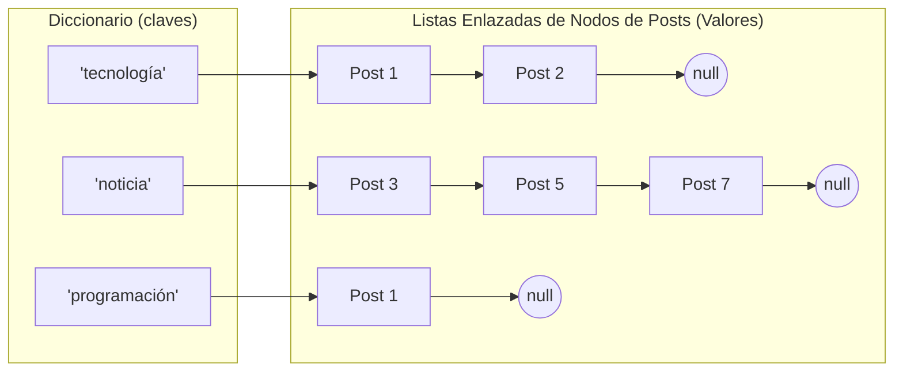
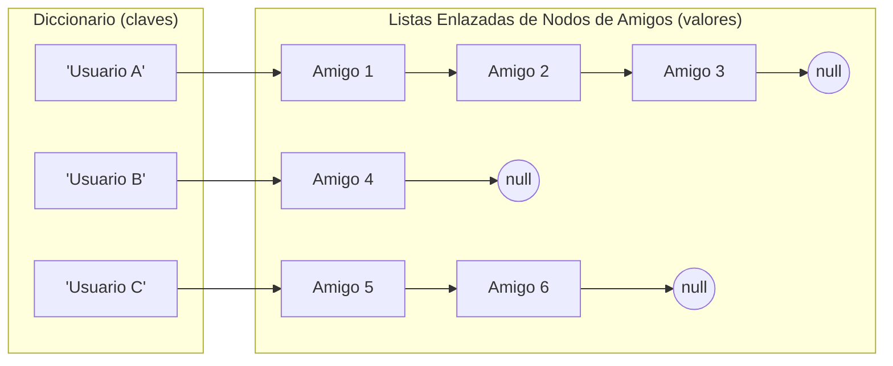

# Estructuras de Datos - Dataset de Twitter con Índice Invertido

Este proyecto implementa índices invertidos sobre memoria dinámica.

## Dataset: Twitter MBTI Personality Types
Se utiliza un dataset real extraído de Twitter que contiene:
- **Perfiles de Usuario:** Identificación única y metadatos.
- **Posts:** Contenido textual original de los tweets.
- **Seguidores:** Qué usuario sigue a qué usuario.

Debido a que el dataset carece de lo siguiente, estos datos serán generados de forma sintética:
- **Registro de Likes:** Registro de likes dados por usuarios.

### Procesamiento de Datos
- Los datos son preprocesados para descartar columnas no usadas y crear las tablas estrictamente necesarias.
- **Filtrado de Stop Words:** Eliminación de artículos, preposiciones y conectores (e.g., "el", "la", "y", "en").
- **Creación sintética de datos:** Ya que nuestro dataset carece de información sobre los likes que ha dado cada usuario a distintos posts nosotros creamos esos datos de forma sintética y aleatoria, utilizando la información de los demás archivos CSV.

### Diagramas de las estructuras de datos creadas




## Estructura del Repositorio
```text
- raw-data/         # Archivos CSV sin procesar del dataset
- data/             # Archivos CSV procesados del dataset
- src/              # Código fuente en Python
- preprocessing/    # Script Python para preprocesar datos CSV
```
