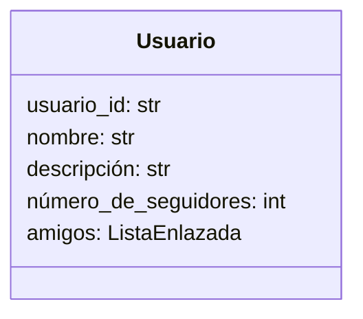
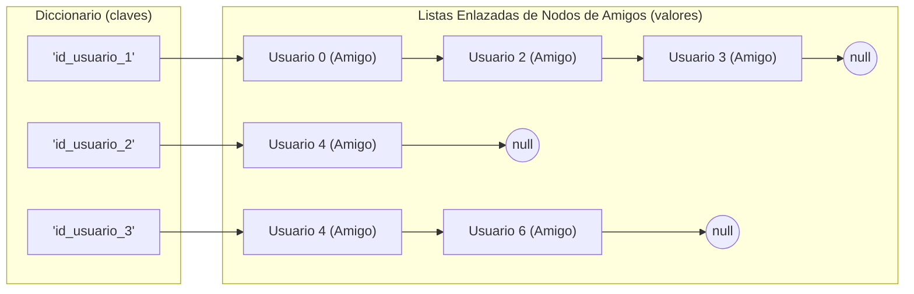
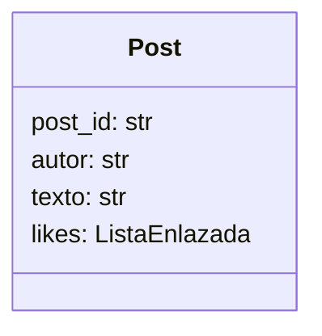
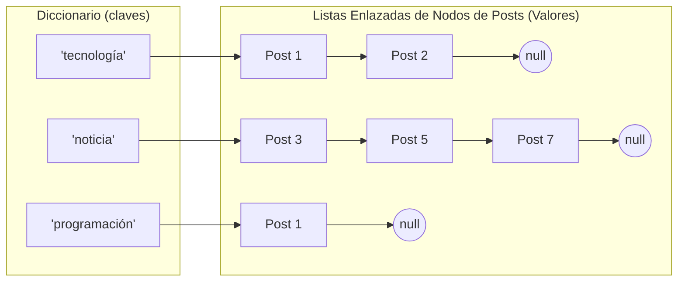
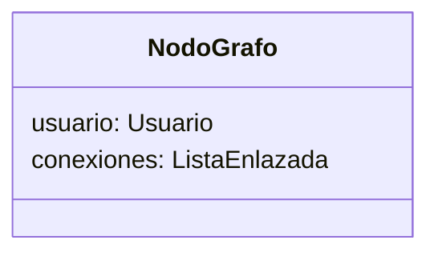
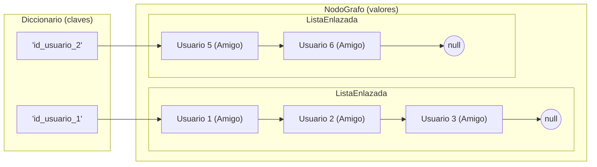

# Estructuras de Datos - Dataset de Twitter con Índice Invertido

Este proyecto implementa manualmente listas enlazadas, índices invertidos, grafos y tablas hash. Todo sobre memoria dinámica.

## Dataset: Twitter MBTI Personality Types

Se utiliza un dataset real extraído de Twitter que contiene:

- **Perfiles de Usuario:** Identificación única y metadatos.
- **Posts:** Contenido textual original de los tweets.
- **Seguidores:** Qué usuario sigue a qué usuario.

Debido a que el dataset carece de lo siguiente, estos datos serán generados de forma sintética:

- **Registro de Likes:** Registro de likes dados por usuarios a posts.

## Tabla de contenido

- [Como ejecutar el proyecto](#como-ejecutar-el-proyecto)
- [Entrega 1](#entrega-1)
  - [Procesamiento de Datos](#procesamiento-de-datos)
  - [Diagramas de las estructuras de datos creadas](#diagramas-de-las-estructuras-de-datos-creadas)
  - [Funciones principales implementadas](#funciones-principales-implementadas)
- [Entrega 2](#entrega-2)
  - [Diagramas de las estructuras de datos creadas](#diagramas-de-las-estructuras-de-datos-creadas-1)
  - [Complejidad algorítmica de `bfs_get_connections`](#complejidad-algorítmica-de-bfs_get_connections)
  - [Funciones principales implementadas](#funciones-principales-implementadas-1)
- [Entrega 3](#entrega-3)
  - [Dimensionamiento del hashmap](#dimensionamiento-del-hashmap)
  - [Funciones principales implementadas](#funciones-principales-implementadas-2)

## Como ejecutar el proyecto

### pre-requisitos:

- Git
- Python
- [Poetry](https://python-poetry.org/docs/) (administrador de dependencias de python)

### paso a paso:

```bash
# clonar repo
git clone https://github.com/College-Homework-Repos/tarea1-estructura-de-datos-twitter-dataset.git
cd tarea1-estructura-de-datos-twitter-dataset

# instalar dependencias (para descargar el dataset)
poetry install

# ejecutar el preprocesado
# - descargar dataset, generar tablas y reducir filas.
# - preprocesar los datos
poetry run python ./preprocessing/main.py

# ejecutar el proyecto
poetry run python ./src/main.py
```

# Entrega 1

## Procesamiento de Datos

- **Reducción de filas:** Ya que el dataset cuenta con al rededor de 10.000 usuarios, los datos se han reducido a 1500 filas para probar el código `data/less_data/` y 5000 filas para la ejecución final `data/release_data/`.
- **Reducción de posts** cada usuario tiene ahora un máximo de 50 posts (en el dataset original son 200).
- **Preprocesamiento de amigos:** Se ha generado una tabla `friends.csv` a partir de la tabla `edges.csv` para facilitar la consulta de amigos de cada usuario.
- **Creación sintética de Likes:** Ya que nuestro dataset carece de información sobre los likes que ha dado cada usuario a distintos posts nosotros creamos esos datos de forma sintética y aleatoria, utilizando la información de los demás archivos CSV en `likes.csv`.

## Diagramas de las estructuras de datos creadas

### Usuarios





### Posts





## Funciones principales implementadas

**Clase `LinkedList`:**

- `add_node`: Inserta un elemento garantizando que no existan duplicados.
- `contains`: Verifica la existencia de un elemento en la estructura.
- `is_empty`: Retorna verdadero si la estructura carece de elementos.

**Índice Invertido de Usuarios (`UsersInvertedIndex`)**

- `load_data_from_csv`: Procesa los archivos CSV para construir el diccionario de usuarios y puebla sus respectivas listas de amigos.
- `get_friends`: Busca y retorna la lista enlazada de contactos directos de un usuario específico.

**Clase (`PostsInvertedIndex`)**

- `load_data_from_csv`: Procesa los archivos CSV para instanciar los posts y vincularlos con sus respectivos likes.
- `search_posts_with_hashtags`: Retorna una lista enlazada con los posts que contienen todos los términos solicitados, calculando la intersección de resultados.
- `_get_hashtags_from_post`: Extrae las palabras de un texto y filtra aquellas que pertenezcan al conjunto de _stopwords_.
- `_intersect_posts()`: Encuentra y retorna los posts comunes entre dos listas enlazadas distintas.

# Entrega 2

## Diagramas de las estructuras de datos creadas





## Complejidad algorítmica de `bfs_get_connections`

Es un método de [SocialGraph](./src/data_structs/graph.py) que realiza un recorrido BFS desde un `root_user_id` usando una cola `queue` y un set `visited`.

Compejidad de:

- cola: O(1) para encolar y desencolar.
- set: O(1) para inserción y búsqueda.
- ListaEnlazada: O(1) al agreagar nodo y O(n) para recorrer la lista completa.

En cada iteración:

- cada usuario se encola como máximo una vez gracias a `visited`.
- al procesar un usuario, se recorre su lista de conexiones completa.
- cada conexión (arista) se inspecciona un número constante de veces.

Por eso, como el grafo se representa como listas enlazadas de adyacencia, la complejidad es `O(U + R)` en el peor caso, donde `U` es la cantidad de usuarios y `R` la cantidad de relaciones de amistad.

## Funciones principales implementadas

**Clase `SocialGraph`**:

- `load_data_from_inverted_index`: Construye los vértices y aristas del grafo a partir de un diccionario de usuarios y el índice invertido.
- `validate_symmetric_relations`: Asegura que todas las relaciones de amistad sean bidireccionales, verificando que el grafo sea no dirigido.
- `bfs_get_connections`: Apartir de un usuario raíz, ejecuta el recorrido por anchura (BFS) para retornar listas de contactos de 1º, 2º y 3º grado.

# Entrega 3

## Dimensionamiento del hashmap

Para obtener M (tamaño del hashmap) y $\alpha$ (factor de carga). Primero calculamos N, que es el número de hashtags únicos, que se obtiene al cargar el indice invertido de posts y obtener la longitud de las claves del diccionario.

Una vez con esos valores, calculamos:
$$
N = 721.093 \\ 
$$
Entonces
$$
M \ge 1.5 \times N \\
M \ge 1.081.639,5 \\
$$
Entonces, buscamos un primo `M` que cumpla con los requisitos.
$$
M = 1.081.657 \\
\alpha = \frac{N}{M} = \frac{721.093}{1.081.657} \approx 0,6666 \le 0.67 \\
$$

## Funciones principales implementadas

**Clase `HashTable`**:

- `_get_djb2_hash`: Función hash que implementa el algoritmo djb2 para determinar la posición (índice) de un hashtag en la tabla.
- `load_data_from_csv`: Procesa el dataset (posts) ignorando las stopwords y contabilizando la frecuencia de aparición de cada hashtag en la tabla hash.
- `get_top_n`: Retorna de manera ordenada (de mayor a menor) los `N` términos más frecuentes del vocabulario. 
- `get_metrics`: Calcula las estadísticas luego de la construcción. Retorna el número total de colisiones, el largo máximo de una lista de colisiones y el largo promedio de dichas lista.
